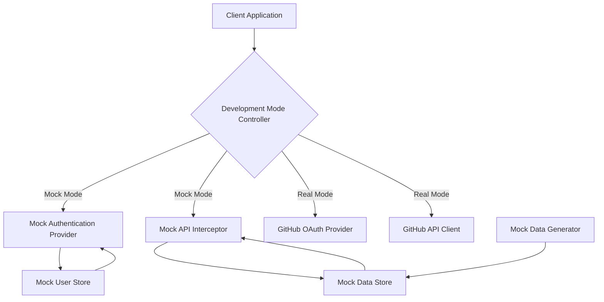

# Design Document: Mock Authentication and Test Data

## Overview

The Mock Authentication and Test Data feature provides a development environment that simulates GitHub OAuth authentication and API responses without requiring real GitHub credentials or repositories. This design document outlines the architecture, components, and implementation details for creating a robust mock system that allows developers to test DevPulse's functionality in isolation.

## Architecture

The mock system will be implemented using a middleware-based approach that intercepts authentication flows and API calls, replacing them with mock implementations when in development mode. The architecture consists of the following key components:

1. **Mock Authentication Provider**: A NextAuth.js custom provider that simulates GitHub OAuth
2. **Mock API Interceptor**: A middleware layer that intercepts GitHub API calls
3. **Mock Data Generator**: A utility for generating realistic test data
4. **Mock Data Store**: A local storage mechanism for persisting mock data
5. **Development Mode Controller**: A central configuration system for toggling between mock and real modes

### System Diagram



## Components and Interfaces

### 1. Development Mode Controller

The Development Mode Controller determines whether the application should use mock or real authentication and API calls based on environment variables.

```typescript
// src/lib/config/dev-mode.ts
export interface DevModeConfig {
  useMockAuth: boolean;
  useMockApi: boolean;
  mockDataSet: string;
  showDevModeIndicator: boolean;
  logMockCalls: boolean;
}

export function getDevModeConfig(): DevModeConfig {
  return {
    useMockAuth: process.env.NEXT_PUBLIC_USE_MOCK_AUTH === 'true',
    useMockApi: process.env.NEXT_PUBLIC_USE_MOCK_API === 'true',
    mockDataSet: process.env.NEXT_PUBLIC_MOCK_DATA_SET || 'default',
    showDevModeIndicator: process.env.NEXT_PUBLIC_SHOW_DEV_MODE_INDICATOR !== 'false',
    logMockCalls: process.env.NEXT_PUBLIC_LOG_MOCK_CALLS !== 'false',
  };
}
```

### 2. Mock Authentication Provider

The Mock Authentication Provider will be implemented as a custom NextAuth.js provider that simulates the GitHub OAuth flow.

```typescript
// src/lib/auth/mock-auth-provider.ts
import { Provider } from 'next-auth/providers';
import { getMockUsers } from '../mock/mock-users';

export function MockProvider(): Provider {
  return {
    id: 'mock-github',
    name: 'Mock GitHub',
    type: 'oauth',
    authorization: { url: '/api/mock/auth' },
    token: { url: '/api/mock/token' },
    userinfo: { url: '/api/mock/user' },
    profile: (profile) => {
      return {
        id: profile.id,
        name: profile.name,
        email: profile.email,
        image: profile.avatar_url,
      };
    },
  };
}
```

### 3. Mock API Interceptor

The Mock API Interceptor will intercept GitHub API calls and return mock responses.

```typescript
// src/lib/github/mock-github-api-client.ts
import { GitHubApiClient } from './github-api-client';
import { getMockData } from '../mock/mock-data-store';

export class MockGitHubApiClient extends GitHubApiClient {
  constructor() {
    super();
  }

  // Override methods to return mock data
  public async getUserRepositories() {
    const mockData = await getMockData();
    return mockData.repositories;
  }

  public async getRepositoryDetails(repoFullName: string) {
    const mockData = await getMockData();
    return mockData.repositories.find(repo => repo.fullName === repoFullName);
  }

  // Additional overridden methods...
}
```

### 4. Mock Data Generator

The Mock Data Generator will create realistic test data that mimics GitHub repositories, commits, pull requests, and other relevant data.

```typescript
// src/lib/mock/mock-data-generator.ts
import { faker } from '@faker-js/faker';
import { Repository, Commit, PullRequest, Issue } from '../types/github';

export interface MockDataOptions {
  repositories: number;
  usersPerRepo: number;
  timeRangeInDays: number;
  activityLevel: 'low' | 'medium' | 'high';
  burnoutPatterns: boolean;
  collaborationPatterns: boolean;
}

export async function generateMockData(options: MockDataOptions) {
  const repositories = generateRepositories(options.repositories);
  const commits = generateCommits(repositories, options);
  const pullRequests = generatePullRequests(repositories, options);
  const issues = generateIssues(repositories, options);
  
  return {
    repositories,
    commits,
    pullRequests,
    issues,
  };
}

// Helper functions for generating specific data types...
```

### 5. Mock Data Store

The Mock Data Store will persist mock data between application restarts.

```typescript
// src/lib/mock/mock-data-store.ts
import { prisma } from '../db/prisma';
import { generateMockData, MockDataOptions } from './mock-data-generator';

export async function getMockData(dataSet = 'default') {
  // Check if mock data exists in the database
  const existingData = await prisma.mockDataSet.findUnique({
    where: { name: dataSet },
    include: { data: true },
  });

  if (existingData) {
    return JSON.parse(existingData.data);
  }

  // Generate new mock data if it doesn't exist
  const options: MockDataOptions = {
    repositories: 5,
    usersPerRepo: 3,
    timeRangeInDays: 90,
    activityLevel: 'medium',
    burnoutPatterns: true,
    collaborationPatterns: true,
  };

  const mockData = await generateMockData(options);

  // Store the generated data
  await prisma.mockDataSet.create({
    data: {
      name: dataSet,
      data: JSON.stringify(mockData),
    },
  });

  return mockData;
}

export async function resetMockData(dataSet = 'default', options?: MockDataOptions) {
  // Delete existing mock data
  await prisma.mockDataSet.delete({
    where: { name: dataSet },
  });

  // Generate and store new mock data
  return getMockData(dataSet);
}
```

### 6. Mock User Profiles

The system will provide predefined mock user profiles with different characteristics.

```typescript
// src/lib/mock/mock-users.ts
export interface MockUser {
  id: number;
  login: string;
  name: string;
  email: string;
  avatar_url: string;
  role: 'developer' | 'team-lead' | 'manager';
  workPattern: 'regular' | 'irregular' | 'overworked';
}

export const mockUsers: MockUser[] = [
  {
    id: 1,
    login: 'regular-dev',
    name: 'Regular Developer',
    email: 'regular@example.com',
    avatar_url: 'https://avatars.githubusercontent.com/u/1',
    role: 'developer',
    workPattern: 'regular',
  },
  {
    id: 2,
    login: 'overworked-dev',
    name: 'Overworked Developer',
    email: 'overworked@example.com',
    avatar_url: 'https://avatars.githubusercontent.com/u/2',
    role: 'developer',
    workPattern: 'overworked',
  },
  // Additional mock users...
];

export function getMockUsers() {
  return mockUsers;
}

export function getMockUserById(id: number) {
  return mockUsers.find(user => user.id === id);
}
```

## Data Models

### Mock Data Set

```prisma
// Addition to prisma/schema.prisma
model MockDataSet {
  id        String   @id @default(uuid())
  name      String   @unique
  data      String   @db.Text
  createdAt DateTime @default(now())
  updatedAt DateTime @updatedAt
}
```

### Mock Data Structure

The mock data will follow the same structure as the real data models used in the application:

```typescript
// src/lib/types/mock.ts
import { Repository, Commit, PullRequest, Issue } from './github';

export interface MockData {
  repositories: Repository[];
  commits: Record<string, Commit[]>; // Key is repository full name
  pullRequests: Record<string, PullRequest[]>; // Key is repository full name
  issues: Record<string, Issue[]>; // Key is repository full name
}
```

## Error Handling

The mock system will include error simulation to test the application's error handling capabilities:

```typescript
// src/lib/mock/mock-errors.ts
export enum MockErrorType {
  RATE_LIMIT_EXCEEDED = 'RATE_LIMIT_EXCEEDED',
  NETWORK_ERROR = 'NETWORK_ERROR',
  AUTHENTICATION_ERROR = 'AUTHENTICATION_ERROR',
  NOT_FOUND = 'NOT_FOUND',
  SERVER_ERROR = 'SERVER_ERROR',
}

export interface MockErrorConfig {
  enabled: boolean;
  probability: number; // 0-1
  types: MockErrorType[];
}

export function shouldSimulateError(config: MockErrorConfig): boolean {
  if (!config.enabled) return false;
  return Math.random() < config.probability;
}

export function getRandomErrorType(config: MockErrorConfig): MockErrorType {
  const index = Math.floor(Math.random() * config.types.length);
  return config.types[index];
}

export function simulateError(type: MockErrorType): never {
  switch (type) {
    case MockErrorType.RATE_LIMIT_EXCEEDED:
      throw new Error('API rate limit exceeded');
    case MockErrorType.NETWORK_ERROR:
      throw new Error('Network error');
    case MockErrorType.AUTHENTICATION_ERROR:
      throw new Error('Authentication failed');
    case MockErrorType.NOT_FOUND:
      throw new Error('Resource not found');
    case MockErrorType.SERVER_ERROR:
      throw new Error('Server error');
  }
}
```

## Testing Strategy

The mock authentication and test data system will be tested using the following approaches:

1. **Unit Tests**: Test individual components like the mock data generator and mock API interceptor
2. **Integration Tests**: Test the interaction between the mock components and the application
3. **End-to-End Tests**: Test the complete flow from authentication to data display

### Test Cases

1. Verify that mock authentication creates a valid user session
2. Verify that mock API calls return the expected data
3. Test error simulation and handling
4. Verify that mock data persistence works correctly
5. Test toggling between mock and real modes

## Implementation Plan

The implementation will follow these steps:

1. Create the development mode controller
2. Implement the mock authentication provider
3. Create the mock API interceptor
4. Develop the mock data generator
5. Implement the mock data store
6. Create mock user profiles
7. Add error simulation
8. Implement the developer UI for mock mode
9. Write documentation

## Considerations

### Security

Even though this is a development feature, we need to ensure that:

1. Mock mode is disabled by default in production environments
2. Mock data does not contain sensitive information
3. The mock system does not introduce security vulnerabilities

### Performance

The mock system should not significantly impact application performance:

1. Mock data should be loaded efficiently
2. API response times should be similar to real API calls to provide realistic testing

### Extensibility

The mock system should be designed to be easily extensible:

1. New mock data types can be added
2. Mock data patterns can be customized
3. Error simulation can be configured