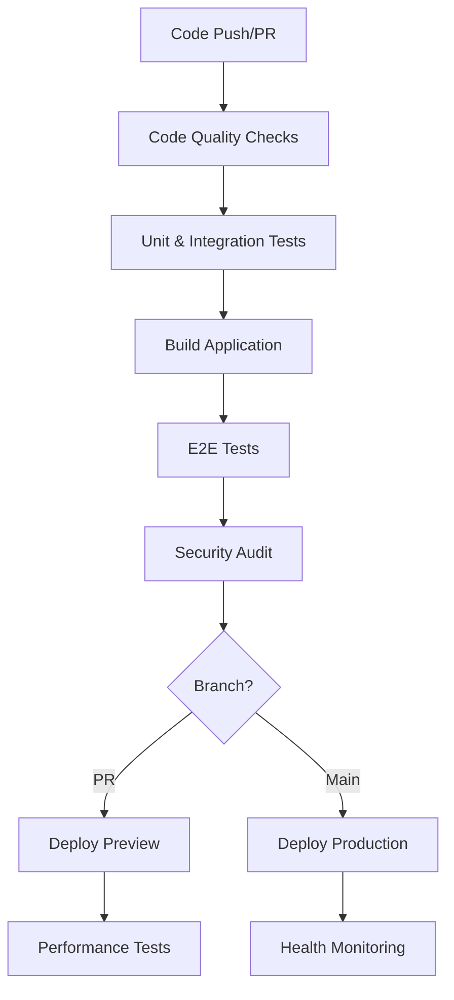

# CI/CD Pipeline Setup Guide

This document provides a comprehensive guide for setting up and maintaining the CI/CD pipeline for DevPulse.

## Overview

The DevPulse CI/CD pipeline provides:

- **Automated Testing**: Unit, integration, and end-to-end tests
- **Code Quality Checks**: Linting, type checking, and static analysis
- **Security Scanning**: Dependency audits and vulnerability detection
- **Performance Monitoring**: Lighthouse audits and bundle analysis
- **Automated Deployments**: Preview and production deployments
- **Release Management**: Automated release creation and deployment

## Pipeline Architecture



## Workflows

### 1. Main CI/CD Pipeline (`ci.yml`)

**Purpose**: Primary pipeline for testing and deployment

**Triggers**:
- Push to `main` or `develop` branches
- Pull requests to `main` or `develop` branches

**Jobs**:
1. **Code Quality** - ESLint, TypeScript, Tailwind verification
2. **Unit & Integration Tests** - Jest tests with database
3. **Build** - Next.js application build
4. **E2E Tests** - Playwright tests across browsers
5. **Security Audit** - npm audit and dependency scanning
6. **Performance Tests** - Lighthouse CI (PR only)
7. **Deploy Preview** - Vercel preview deployment (PR only)
8. **Deploy Production** - Production deployment (main only)

### 2. Code Quality Analysis (`code-quality.yml`)

**Purpose**: Deep code analysis and quality metrics

**Triggers**:
- Push to main branches
- Pull requests
- Weekly schedule (Sundays 2 AM UTC)

**Jobs**:
1. **CodeQL Analysis** - GitHub semantic code analysis
2. **SonarCloud Analysis** - Code quality and security
3. **Bundle Analysis** - Next.js bundle size tracking
4. **Accessibility Audit** - Automated a11y testing

### 3. Dependency Management (`dependency-updates.yml`)

**Purpose**: Automated dependency updates and security monitoring

**Triggers**:
- Weekly schedule (Mondays 9 AM UTC)
- Manual dispatch

**Jobs**:
1. **Update Dependencies** - Automated updates with testing
2. **Security Scan** - Snyk vulnerability scanning

### 4. Release Management (`release.yml`)

**Purpose**: Automated release creation and deployment

**Triggers**:
- Git tags (v*)
- Manual dispatch

**Jobs**:
1. **Create Release** - GitHub release with changelog
2. **Deploy Release** - Production deployment
3. **Notify Release** - Slack notifications

### 5. Production Monitoring (`monitoring.yml`)

**Purpose**: Continuous production health monitoring

**Triggers**:
- Every 15 minutes
- Manual dispatch

**Jobs**:
1. **Health Check** - Endpoint monitoring
2. **Uptime Check** - Availability monitoring
3. **Performance Monitoring** - Lighthouse audits

## Setup Instructions

### Prerequisites

1. **GitHub Repository** with admin access
2. **Vercel Account** for deployment
3. **SonarCloud Account** for code analysis
4. **Snyk Account** for security scanning (optional)

### Step 1: GitHub Secrets Configuration

Navigate to your repository settings and add these secrets:

#### Required Secrets

```bash
# Vercel Deployment
VERCEL_TOKEN=your_vercel_token
VERCEL_ORG_ID=your_vercel_org_id
VERCEL_PROJECT_ID=your_vercel_project_id

# SonarCloud Analysis
SONAR_TOKEN=your_sonar_token
```

#### Optional Secrets

```bash
# Lighthouse CI
LHCI_GITHUB_APP_TOKEN=your_lighthouse_token

# Security Scanning
SNYK_TOKEN=your_snyk_token

# Notifications
SLACK_WEBHOOK_URL=your_slack_webhook
```

### Step 2: Vercel Configuration

1. **Connect Repository**:
   - Go to Vercel dashboard
   - Import your GitHub repository
   - Select the `devpulse` directory as root

2. **Build Settings**:
   ```bash
   Build Command: npm run ci:build
   Output Directory: .next
   Install Command: npm ci
   Root Directory: devpulse
   ```

3. **Environment Variables**:
   - Copy all variables from `.env.example`
   - Set production values for each variable

### Step 3: SonarCloud Configuration

1. **Import Project**:
   - Go to SonarCloud dashboard
   - Import your GitHub repository
   - Set project key to match `sonar-project.properties`

2. **Quality Gate**:
   - Configure quality gate rules
   - Set coverage thresholds
   - Enable automatic analysis

### Step 4: Branch Protection Rules

Configure protection for the `main` branch:

1. **Required Status Checks**:
   - Code Quality
   - Unit & Integration Tests
   - Build Application
   - E2E Tests
   - Security Audit

2. **Additional Settings**:
   - Require pull request reviews
   - Require branches to be up to date
   - Restrict pushes to matching branches

### Step 5: Validation

Run the validation script to ensure everything is configured correctly:

```bash
cd devpulse
node scripts/validate-ci-setup.js
```

## Local Development Workflow

### Running CI Checks Locally

```bash
# Full CI setup
npm run ci:setup

# Run all checks
npm run ci:test

# Individual checks
npm run lint
npm run type-check
npm test
npm run build
npm run test:e2e
```

### Pre-commit Checks

Create a pre-commit hook to run checks before committing:

```bash
#!/bin/sh
cd devpulse
npm run lint
npm run type-check
npm test -- --watchAll=false
```

## Monitoring and Alerts

### Health Monitoring

The pipeline includes comprehensive monitoring:

- **Endpoint Health**: Checks critical API endpoints every 15 minutes
- **Performance**: Lighthouse audits on schedule and PR changes
- **Security**: Daily vulnerability scans and audit reports
- **Uptime**: Continuous availability monitoring

### Alert Configuration

Alerts are automatically created for:

- Failed health checks (GitHub issues)
- Performance degradation (PR comments)
- Security vulnerabilities (Snyk reports)
- Build failures (GitHub notifications)

## Troubleshooting

### Common Issues

#### Build Failures

**Symptoms**: Build job fails in CI
**Solutions**:
1. Check TypeScript errors: `npm run type-check`
2. Verify dependencies: `npm ci`
3. Update Prisma client: `npm run db:generate`
4. Check environment variables

#### Test Failures

**Symptoms**: Tests pass locally but fail in CI
**Solutions**:
1. Check database connection in CI
2. Verify test environment variables
3. Review mock data setup
4. Check for timing issues in tests

#### Deployment Failures

**Symptoms**: Vercel deployment fails
**Solutions**:
1. Verify Vercel configuration
2. Check build command and output directory
3. Review environment variables in Vercel
4. Check build logs for errors

#### Performance Issues

**Symptoms**: Lighthouse scores below threshold
**Solutions**:
1. Review bundle analysis reports
2. Optimize images and assets
3. Check Core Web Vitals
4. Review performance budget

### Getting Help

1. **Check Workflow Logs**: Review detailed logs in GitHub Actions
2. **Review Error Messages**: Look for specific error details
3. **Consult Documentation**: Check this guide and external docs
4. **Create Issues**: Use issue templates for bug reports

## Best Practices

### Code Quality

- **Write Tests**: Maintain high test coverage (>80%)
- **Follow Standards**: Use ESLint and Prettier configurations
- **Type Safety**: Use TypeScript strictly
- **Documentation**: Keep docs updated with changes

### Security

- **Dependencies**: Keep dependencies updated
- **Secrets**: Never commit secrets to repository
- **Audits**: Review security audit results regularly
- **Permissions**: Use least privilege principle

### Performance

- **Bundle Size**: Monitor and optimize bundle size
- **Core Web Vitals**: Maintain good performance scores
- **Caching**: Use appropriate caching strategies
- **Monitoring**: Regular performance audits

### Deployment

- **Testing**: Thoroughly test in preview environments
- **Rollback**: Have rollback procedures ready
- **Monitoring**: Monitor deployment health
- **Feature Flags**: Use for risky changes

## Maintenance

### Regular Tasks

- **Weekly**: Review dependency updates
- **Monthly**: Review security audit results
- **Quarterly**: Update CI/CD pipeline configurations
- **As Needed**: Update documentation and troubleshooting guides

### Updates and Improvements

- Monitor GitHub Actions marketplace for new actions
- Review and update workflow configurations
- Optimize build times and resource usage
- Add new quality checks as needed

## Resources

- [GitHub Actions Documentation](https://docs.github.com/en/actions)
- [Vercel Deployment Guide](https://vercel.com/docs)
- [SonarCloud Documentation](https://docs.sonarcloud.io/)
- [Lighthouse CI Documentation](https://github.com/GoogleChrome/lighthouse-ci)
- [Next.js Deployment Guide](https://nextjs.org/docs/deployment)