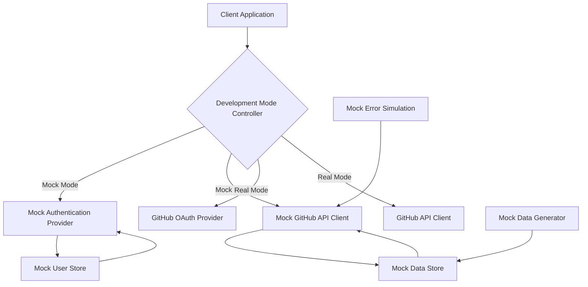

# Developer Guide for Mock Functionality

This guide provides information for developers who want to extend or modify the mock functionality in DevPulse.

## Overview

DevPulse's mock system is designed to be modular and extensible, allowing developers to add new features, modify existing functionality, or customize the mock data to suit their needs.

## Architecture

The mock system consists of the following key components:

1. **Development Mode Controller**: Central configuration system for toggling between mock and real modes
2. **Mock Authentication Provider**: Custom NextAuth.js provider that simulates GitHub OAuth
3. **Mock GitHub API Client**: Mock implementation of the GitHub API client
4. **Mock Data Generator**: Utility for generating realistic test data
5. **Mock Data Store**: Local storage mechanism for persisting mock data
6. **Mock User Store**: Storage and management for mock users
7. **Mock Error Simulation**: System for simulating various error scenarios

### Component Relationships



## Key Files and Directories

```
devpulse/
├── src/
│   ├── lib/
│   │   ├── auth/
│   │   │   └── mock-auth-provider.ts       # Mock authentication provider
│   │   ├── config/
│   │   │   └── dev-mode.ts                # Development mode controller
│   │   ├── github/
│   │   │   └── mock-github-api-client.ts  # Mock GitHub API client
│   │   └── mock/
│   │       ├── mock-data-generator.ts     # Mock data generator
│   │       ├── mock-data-store.ts         # Mock data persistence
│   │       ├── mock-errors.ts             # Error simulation
│   │       ├── mock-users.ts              # Mock user profiles
│   │       └── mock-user-store.ts         # Mock user persistence
│   ├── app/
│   │   ├── api/
│   │   │   └── mock/                      # Mock API routes
│   │   └── auth/
│   │       └── mock/                      # Mock authentication UI
│   └── components/
│       ├── mock/                          # Mock data management UI
│       └── ui/
│           └── dev-mode-indicator.tsx     # Development mode indicator
└── docs/
    └── mock-mode/                         # Mock mode documentation
```

## Extending the Mock System

### Adding New Mock Users

To add new mock users, edit the `mockUsers` array in `src/lib/mock/mock-users.ts`:

```typescript
export const mockUsers: MockUser[] = [
  // Existing users...
  
  // Add a new user
  {
    id: 1011,
    login: 'your-new-user',
    name: 'Your New User',
    email: 'your.new.user@example.com',
    avatar_url: 'https://avatars.githubusercontent.com/u/1011',
    html_url: 'https://github.com/your-new-user',
    role: 'developer',
    workPattern: 'regular',
    activityLevel: 'medium',
    collaborationStyle: 'team-player',
    responseTime: 'average',
    workHours: 'standard',
    specialties: ['your-specialty']
  },
];
```

### Customizing Mock Data Generation

To customize mock data generation, modify the generator functions in `src/lib/mock/mock-data-generator.ts`:

```typescript
// Add a new generator function
export function generateCustomData(options: MockDataOptions): CustomData[] {
  // Your custom data generation logic
  return customData;
}

// Modify an existing generator function
export function generateRepositories(options: MockDataOptions): Repository[] {
  // Modified repository generation logic
  return repositories;
}
```

### Adding New Error Types

To add new error types, modify the `MockErrorType` enum in `src/lib/mock/mock-errors.ts`:

```typescript
export enum MockErrorType {
  // Existing error types...
  RATE_LIMIT_EXCEEDED = 'RATE_LIMIT_EXCEEDED',
  NETWORK_ERROR = 'NETWORK_ERROR',
  
  // Add a new error type
  YOUR_CUSTOM_ERROR = 'YOUR_CUSTOM_ERROR',
}

// Update the simulateError function to handle the new error type
export function simulateError(type: MockErrorType): never {
  switch (type) {
    // Existing cases...
    
    // Add a new case
    case MockErrorType.YOUR_CUSTOM_ERROR:
      throw new AppError(
        ErrorCode.CUSTOM_ERROR,
        'Your custom error message',
        400
      );
  }
}
```

### Adding New API Endpoints

To add new mock API endpoints, create a new route file in `src/app/api/mock/`:

```typescript
// src/app/api/mock/your-endpoint/route.ts
import { NextRequest, NextResponse } from 'next/server';
import { getDevModeConfig } from '@/lib/config/dev-mode';

export async function GET(request: NextRequest) {
  const config = getDevModeConfig();
  
  if (!config.useMockApi) {
    return NextResponse.json(
      { error: 'Mock API is disabled' },
      { status: 400 }
    );
  }
  
  // Your mock API logic
  const mockData = {
    // Your mock data
  };
  
  return NextResponse.json(mockData);
}
```

### Extending the Mock GitHub API Client

To add new methods to the mock GitHub API client, modify `src/lib/github/mock-github-api-client.ts`:

```typescript
export class MockGitHubApiClient extends GitHubApiClient {
  // Existing methods...
  
  // Add a new method
  public async getYourCustomData(): Promise<YourCustomData> {
    this.logMockCall('getYourCustomData');
    this.updateRateLimits();
    
    return executeWithErrorSimulation(async () => {
      try {
        const mockData = await getMockData(this.mockDataSet);
        // Your custom logic
        return customData;
      } catch (error) {
        console.error('Error getting custom data:', error);
        return [];
      }
    }, this.errorConfig);
  }
}
```

### Customizing the Development Mode Indicator

To customize the development mode indicator, modify `src/components/ui/dev-mode-indicator.tsx`:

```typescript
export default function DevModeIndicator() {
  // Existing code...
  
  // Add your custom UI elements or tabs
  const [activeTab, setActiveTab] = useState<'info' | 'logs' | 'users' | 'debug' | 'custom'>('info');
  
  // Render your custom tab content
  {activeTab === 'custom' && (
    <div>
      {/* Your custom content */}
    </div>
  )}
}
```

## Testing Mock Functionality

### Unit Tests

Unit tests for mock functionality are located in the `__tests__` directories:

- `src/lib/mock/__tests__/`: Tests for mock data generation, storage, and user management
- `src/lib/github/__tests__/`: Tests for the mock GitHub API client
- `src/components/mock/__tests__/`: Tests for mock data management UI

To run the tests:

```bash
npm run test
```

### Manual Testing

To manually test mock functionality:

1. Enable mock mode in your `.env` file
2. Start the development server: `npm run dev`
3. Sign in with a mock user
4. Verify that mock data is displayed correctly
5. Use the development mode indicator to access mock functionality
6. Use the mock data management UI to reset, configure, import, and export mock data

## Best Practices

### Maintaining Realistic Data

When extending the mock data generator, ensure that the generated data remains realistic and follows real-world patterns:

- Use realistic naming conventions for repositories, branches, etc.
- Generate commit messages that follow conventional commit format
- Create realistic activity patterns based on user characteristics
- Ensure timestamps follow logical sequences

### Error Handling

When adding new functionality, ensure proper error handling:

- Use try-catch blocks to handle exceptions
- Log errors to the console for debugging
- Return meaningful error messages
- Use the error simulation system to test error scenarios

### Performance Considerations

To maintain good performance:

- Avoid generating excessive amounts of mock data
- Use pagination for large data sets
- Cache generated data when appropriate
- Optimize data generation algorithms for speed

### Code Organization

Follow these guidelines for code organization:

- Keep related functionality in the same file or directory
- Use clear and descriptive names for functions and variables
- Add comments to explain complex logic
- Update documentation when adding new features

## Troubleshooting Common Issues

### Mock Data Not Generating

If mock data is not generating:

1. Check that the database is properly initialized
2. Verify that the mock data store functions are working correctly
3. Check for errors in the console
4. Try resetting the mock data manually

### Mock Authentication Not Working

If mock authentication is not working:

1. Verify that `NEXT_PUBLIC_USE_MOCK_AUTH` is set to `true`
2. Check that the mock authentication provider is properly configured
3. Clear your browser cache and cookies
4. Check for errors in the console

### Mock API Calls Failing

If mock API calls are failing:

1. Verify that `NEXT_PUBLIC_USE_MOCK_API` is set to `true`
2. Check that the mock GitHub API client is properly configured
3. Verify that mock data exists in the database
4. Check for errors in the console

## Next Steps

- Return to the [Setup Guide](./setup-guide.md) for general mock mode configuration
- Explore the [Mock Users Guide](./mock-users.md) to learn about available mock user profiles
- Check the [Mock Data Structure Guide](./mock-data-structure.md) for details on the mock data format